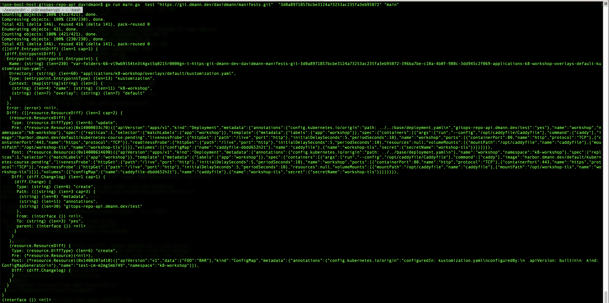

# Git Repo API

Provides an API ontop of a Gitops Repo

# Diff
Diff the kubernetes resources between 2 commits in all discovered entrypoints in a repo
See [./cmd/test.go](./cmd/test.go)

# CRUD
A CRUD API for interacting with kubernetes resources in the repository

## Glossary

* *Entrypoint*: A directory that will be deployed to a kubernetes cluster, could be a Kustomize overlay or a helm chart directory